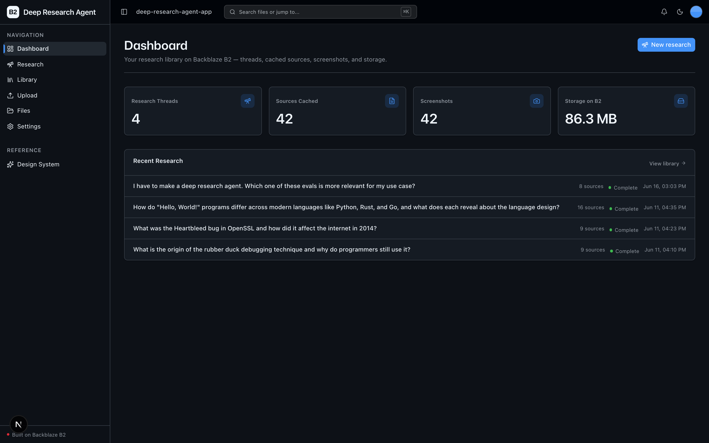
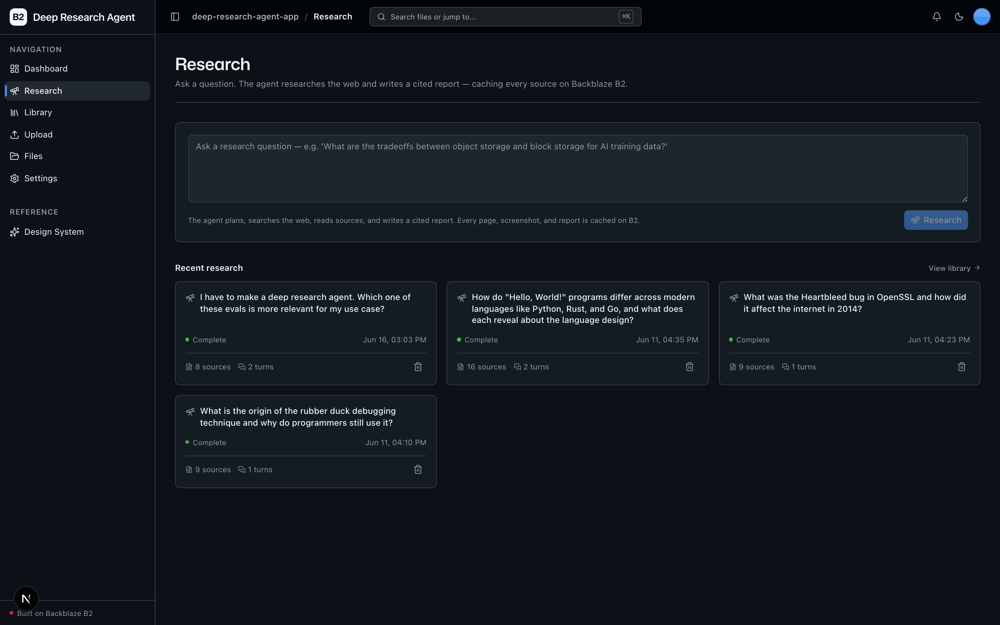
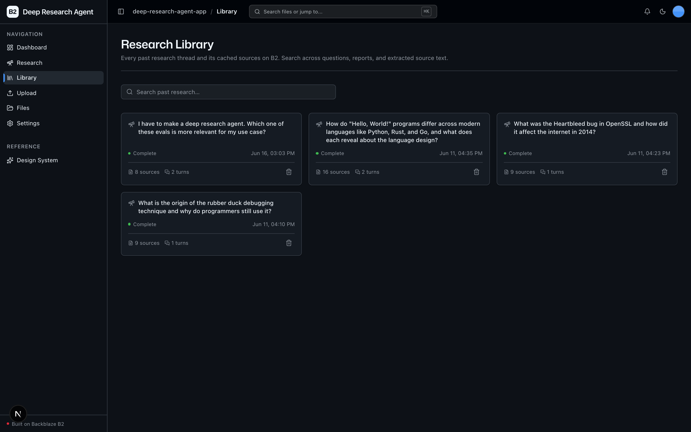

<!-- last_verified: 2026-06-11 -->
# Deep Research Agent

A deep-research agent that turns a question into a long-form, cited report — and
caches **every artifact it touches on [Backblaze B2](https://www.backblaze.com/sign-up/ai-cloud-storage?utm_source=github&utm_medium=referral&utm_campaign=ai_artifacts&utm_content=b2ai-deep-research-agent-app)**. The agent plans, searches the web, fetches and reads source pages, and writes the report. Each fetched page is stored as raw HTML, a readable-text extraction, and a full-page screenshot; the final report is stored too. Past research stays browsable and keyword-searchable, so a durable research library accumulates over time.

The B2 value on display: **agentic workloads write many artifacts to cheap, durable, S3-compatible object storage and read them back.** Cached pages, screenshots, and reports stack up fast — B2 is the agent's memory.

**What you get out of the box:**
- A real Claude Sonnet 4.6 tool-use agent loop (plan → web search → read sources → write a cited report)
- Source caching on B2 — every page becomes HTML + readable Markdown + a full-page screenshot with provenance metadata
- A scoped **Research Library** to browse every past thread and its cached sources/screenshots
- **Follow-up question chains** that reuse a thread's prior reports as cached context
- Keyword/metadata search across past questions, reports, and extracted source text
- Full-stack dashboard UI (Next.js 16 + React 19 + Tailwind v4 + shadcn/ui), a FastAPI backend with strict layering and structural tests, and agent-optimized docs

The starter kit's full-bucket File Explorer (`/files`) and Upload (`/upload`) surfaces are kept as-is — useful for inspecting the raw `research/` objects on B2.

## What it looks like

**Dashboard** — research threads, sources cached, screenshots, and total storage on B2 at a glance, with recent research below.



**Research** — ask a question and watch the agent plan, search the web, read sources, and write a cited report, with recent research alongside.



**Research Library** — every past thread and its cached source pages, screenshots, and reports, searchable across questions, reports, and extracted source text.



## How it works

```
                                 ┌──────────────────────────────┐
  Ask a question  ──▶  FastAPI ──┤  Claude Sonnet 4.6 agent loop │
                       (bg task) │  (manual tool-use)            │
                                 └───────┬───────────────┬───────┘
                                  web_search        fetch_source(url)
                                 (Anthropic,         (we execute it)
                                  bundled)                 │
                                                           ▼
                                              Playwright renders the page
                                              trafilatura extracts text
                                                           │
                                                           ▼
                            ┌──────────────────────────────────────────────┐
                            │  Backblaze B2 (S3 API)  research/<id>/         │
                            │    report.md · report.json · thread.json       │
                            │    sources/<sid>/ page.html · page.md ·         │
                            │                   screenshot.png · meta.json    │
                            └──────────────────────────────────────────────┘
```

Status is derived from B2 object existence (no database) and the frontend polls
for it. See [ARCHITECTURE.md](ARCHITECTURE.md) for the full data flow.

## Quick Start

You need: Node.js >= 20, pnpm >= 9, Python >= 3.11, a free **[Backblaze B2 account](https://www.backblaze.com/sign-up/ai-cloud-storage?utm_source=github&utm_medium=referral&utm_campaign=ai_artifacts&utm_content=b2ai-deep-research-agent-app)**, and an **[Anthropic API key](https://console.anthropic.com/)**.

> **Cost note.** The research agent is a *real* Claude Sonnet 4.6 tool-use loop with bundled web search and page reads. A single full research run typically costs **~$0.50–$1.10** (model tokens + ~6–10 web searches + reading ~6–10 pages, with prompt caching reducing re-reads). Tune it down with `RESEARCH_MAX_SEARCHES` / `RESEARCH_MAX_SOURCES`.

### Setup

**1. Install dependencies**

```bash
pnpm install
```

**2. Set up the backend (incl. the Playwright browser)**

```bash
cd services/api
python -m venv .venv && source .venv/bin/activate
pip install -r requirements.txt
python -m playwright install chromium   # the agent renders pages in headless Chromium
cd ../..
```

**3. Add your credentials**

```bash
cp .env.example .env
```

Open `.env` and fill it in. Head to the [Backblaze B2 dashboard](https://secure.backblaze.com/b2_buckets.htm?utm_source=github&utm_medium=referral&utm_campaign=ai_artifacts&utm_content=b2ai-deep-research-agent-app) and:

1. **Create a bucket.** Paste each value into `.env`:
   - **Bucket Unique Name** → `B2_BUCKET_NAME`
   - **Region** → `B2_REGION` (e.g. `us-west-004`)
2. **Create an application key** with `Read and Write` permission:
   - **keyID** → `B2_APPLICATION_KEY_ID`
   - **applicationKey** → `B2_APPLICATION_KEY` *(only shown once)*
3. Optional for public buckets: set `B2_PUBLIC_URL_BASE` to the public object
   URL base.
4. **Add your Anthropic key** → `ANTHROPIC_API_KEY` (from [console.anthropic.com](https://console.anthropic.com/)).

> Walkthroughs: [creating a bucket](https://www.backblaze.com/docs/cloud-storage-create-and-manage-buckets?utm_source=github&utm_medium=referral&utm_campaign=ai_artifacts&utm_content=b2ai-deep-research-agent-app) · [creating app keys](https://www.backblaze.com/docs/cloud-storage-create-and-manage-app-keys?utm_source=github&utm_medium=referral&utm_campaign=ai_artifacts&utm_content=b2ai-deep-research-agent-app).

**4. Run it**

```bash
pnpm dev
```

Frontend at `localhost:3000`, API at `localhost:8000`. Open **Research**, ask a question, and watch sources get cached to B2 as the agent reads them.

`pnpm dev` runs `pnpm doctor` first — a preflight that catches the common gotchas (wrong Node/Python version, missing venv, missing/placeholder `.env`, missing Chromium, ports in use) and tells you how to fix each one.

### Environment variables

| Variable | Required | Description |
|----------|----------|-------------|
| `B2_REGION` | yes | B2 S3 region, e.g. `us-west-004`; the S3 endpoint is derived from it |
| `B2_APPLICATION_KEY_ID` | yes | B2 application key ID |
| `B2_APPLICATION_KEY` | yes | B2 application key |
| `B2_BUCKET_NAME` | yes | Target bucket |
| `B2_PUBLIC_URL_BASE` | no | Public object URL base for public buckets |
| `ANTHROPIC_API_KEY` | yes | Powers the research agent |
| `ANTHROPIC_MODEL` | no | Default `claude-sonnet-4-6` |
| `RESEARCH_MAX_SEARCHES` | no | Web-search cap per run (default 8) |
| `RESEARCH_MAX_SOURCES` | no | Pages fetched/cached per run (default 8) |
| `RESEARCH_EFFORT` | no | Adaptive-thinking effort: `low`/`medium`/`high` (default `medium`) |

### B2 environment migration

The app now uses the standardized B2 environment contract above. Roll it out
in expand/contract order: first add `B2_REGION` and, for public buckets,
`B2_PUBLIC_URL_BASE` while keeping any existing legacy variables. During this
phase `B2_ENDPOINT` is accepted but ignored because runtime S3 traffic always
derives the endpoint from `B2_REGION`. `B2_PUBLIC_URL` is accepted only as a
temporary fallback when `B2_PUBLIC_URL_BASE` is not set.

After every local and hosted environment has the standard variables, remove
the legacy `B2_ENDPOINT` and `B2_PUBLIC_URL` entries from `.env` files and
deployment secrets.

## Core Features

- [Research Agent](docs/features/research-agent.md) — the Claude Sonnet 4.6 tool-use loop that plans, searches, reads, and writes a cited report
- [Source Caching on B2](docs/features/source-cache.md) — every fetched page → HTML + readable Markdown + full-page screenshot + metadata
- [Research Library](docs/features/research-library.md) — scoped explorer over the `research/` prefix
- [Report Viewer](docs/features/report-viewer.md) — rendered Markdown report with inline citations
- [Follow-up Chains](docs/features/follow-up-chains.md) — questions that build on prior reports
- [Search Across Research](docs/features/research-search.md) — keyword/metadata search (semantic search is a v2 item)
- [Dashboard](docs/features/dashboard.md) — research metrics over B2
- Kept from the starter kit: [File Upload](docs/features/file-upload.md), [File Browser](docs/features/file-browser.md), [Metadata Extraction](docs/features/metadata-extraction.md), [Design System](docs/design-system.md)

## Tech Stack

- TypeScript, Next.js 16, React 19, Tailwind v4, shadcn/ui, TanStack Query, react-markdown + remark-gfm
- Python 3.11+, FastAPI, boto3, Pydantic v2
- **anthropic** (Claude Sonnet 4.6 + bundled web search), **playwright** (headless Chromium), **trafilatura** (readable-text extraction)
- Backblaze B2 (S3-compatible object storage) — the agent's durable memory
- pnpm workspaces (monorepo)

## Commands

| Command | What it does |
|---------|-------------|
| `pnpm dev` | Start frontend + backend |
| `pnpm dev:web` | Frontend only |
| `pnpm dev:api` | Backend only |
| `pnpm build` | Build frontend |
| `pnpm lint` | Lint frontend |
| `pnpm lint:api` | Lint backend (ruff) |
| `pnpm test:api` | Run backend tests |
| `pnpm check:structure` | Verify layering + SDK-containment rules |
| `pnpm test:e2e` | Playwright e2e tests (run `pnpm --filter @deep-research-agent-app/web exec playwright install chromium` once first) |

## Documentation Map

| Doc | Purpose |
|-----|---------|
| [AGENTS.md](AGENTS.md) | Agent table of contents — start here |
| [ARCHITECTURE.md](ARCHITECTURE.md) | System layout, layering, data flows, B2 prefix layout |
| [docs/features/](docs/features/) | Feature docs |
| [docs/app-workflows.md](docs/app-workflows.md) | User journeys |
| [docs/dev-workflows.md](docs/dev-workflows.md) | Engineering workflows and testing |
| [docs/SECURITY.md](docs/SECURITY.md) | Security principles (incl. SSRF + prompt-injection guards) |
| [docs/RELIABILITY.md](docs/RELIABILITY.md) | Reliability expectations |
| [docs/exec-plans/](docs/exec-plans/) | Execution plans and tech debt tracker |

## License

MIT License - see [LICENSE](LICENSE) for details.

## Claude Agent B2 Skill

Manage Backblaze B2 from your terminal using natural language (list/search, audits, stale or large file detection, security checks, safe cleanup).

Repo: [https://github.com/backblaze-b2-samples/claude-skill-b2-cloud-storage](https://github.com/backblaze-b2-samples/claude-skill-b2-cloud-storage)
